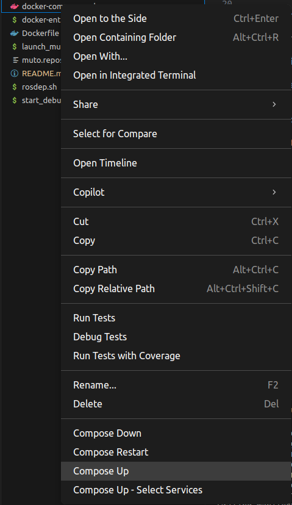
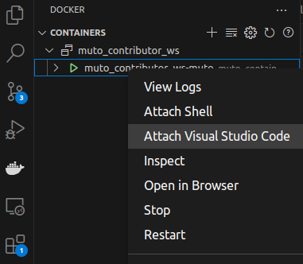
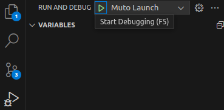

# Muto Contributor Workspace

This workspace gets you quickly started by having ready to use shell scripts and docker services to ease the workspace set-up pain.

## To Start the Muto Service:
```bash
docker compose up -d
```

# Launch Muto
While inside the container:
```bash
ros2 launch /muto_ws/launch/muto.launch.py vehicle_id:=contributor-01

# or you could use the `launch_muto.sh` script
/muto_ws/launch_muto.sh
```

## Attaching VS Code
You need to install [Docker](vscode:extension/ms-azuretools.vscode-docker) and [Dev Containers](vscode:extension/ms-vscode-remote.remote-containers) extensions to be able to use the container within VS Code. After installing those, you could:

### 1- Right Click the `docker-compose.yml` file and choose `Compose Up`
</img>

### 2- In the Menu Bar, Go to Docker. Right click to container and choose `Attach Visual Studio Code`

</img>

# VS Code Debug Tool

`Ctrl + Shift + D` is the default shortcut for `Run and Debug`. After you go there, locate:

</img>

This will launch Muto with all the components. From there on, you could execute and debug your code.

# Contributing

See [Contributing](./CONTRIBUTING.md) and [Coding Guideline](./CODING_GUIDELINE.md)
